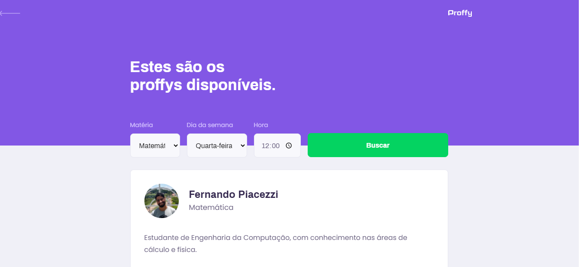

<h1 align="center">
<br>
    
<br>


##
<h3 align="center">
Projeto realizado na Next Level Week #2

<h6 align="center">  
  Projeto desenvolvido por <a href="https://github.com/fernandopiacezzi">Fernando Piacezzi</a>

##

<p align="center">
  <a href="#sobre">Sobre</a>&nbsp;&nbsp;&nbsp;|&nbsp;&nbsp;&nbsp;
  <a href="#preview">Preview</a>&nbsp;&nbsp;&nbsp;|&nbsp;&nbsp;&nbsp;
  <a href="#tecnologias">Tecnologias</a>&nbsp;&nbsp;&nbsp;|&nbsp;&nbsp;&nbsp;
  <a href="#como-executar">Como Executar</a>
</p>

## Sobre

O **Proffy** é um projeto desenvolvido durante a Next Level Week #2, realizada pela [Rocketseat](https://rocketseat.com.br), e tem como objetivo conectar alunos e professores.

A plataforma web permite com que os professores realizem um cadastro com informações a respeito da disciplina, dos horários disponíveis e do custo hora/aula. Permite também que os alunos busquem por aulas, assim como na aplicação mobile. 

## Preview

<h3 align="center"> 
web
<div>
  
  
</div>

### 
<h3 align="center">
mobile
<div >
  
  
  
</div>

## Tecnologias

- [Typescript](https://www.typescriptlang.org/)
- [React](https://reactjs.org/)
- [React Native](https://reactnative.dev/)
- [Expo](https://expo.io/)

## Como executar

```
//clonar o repositório
git clone https://github.com/FernandoPiacezzi/Proffy_NLW.git
```

### **- Executar o server**

```bash
# ir para a pasta server
cd Proffy_NLW/server

#instalar dependências
yarn install

#executar a aplicação
yarn start
```

 A API será executada em: http://localhost:3333/

### **- Executar o web**

```bash
# ir para a pasta web
cd Proffy_NLW/web

#instalar dependências
yarn install

#executar a aplicação
yarn start
```
Para visualizar a aplicação basta ir em: http://localhost:3000/


### **- Executar o mobile**

Para executar o mobile é necessário o aplicativo do [expo](https://play.google.com/store/apps/details?id=host.exp.exponent), seja em um smartphone ou em um emulador.

```bash
# ir para a pasta mobile
cd Proffy_NLW/mobile

#instalar dependências
yarn install

#executar a aplicação
yarn start
```
Para visualizar a aplicação basta ler o QRCode com o aplicativo do [expo](https://play.google.com/store/apps/details?id=host.exp.exponent), ou executá-lo no emulador.
